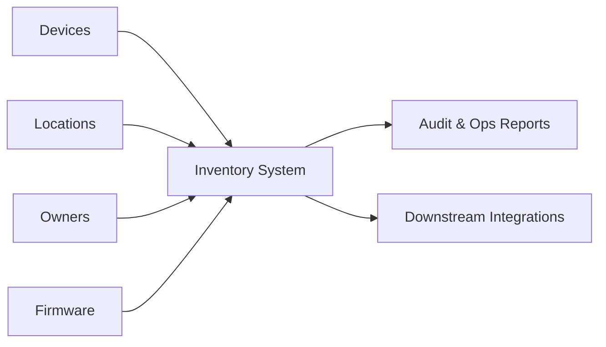

# smart-home-inventory-system-

## Prompt: Personal Stock Monitor (IoT + App) with Subagents

You are building a personal stock monitoring system that runs on an IoT
device (Raspberry Pi or similar) with a physical sensor and a server that
displays the status of individual sensors/items in a mobile app or web app.
The system is for personal use, but it must be reliable, secure, and easy to
maintain.

You must use subagents and allow me to control orchestration. Use three
subagents with distinct responsibilities:

- Agent 1 (Planner): scope, requirements, architecture, and phased plan.
- Agent 2 (IoT): hardware integration, sensor reading, device app, and
  device-to-server communication.
- Agent 3 (UI): web/mobile UI, data presentation, and user flows.

I am the orchestrator. Do not auto-run tasks for other agents without asking
me. Provide a concise menu of options for what I can trigger next after each
agent's output. Keep handoffs explicit and await confirmation before
continuing.

### Product Requirements

- IoT device (Raspberry Pi or similar) with a physical sensor (e.g. weight,
  reed switch, RFID, or IR) to track item stock presence/level.
- Device program reads sensor data, performs debouncing/calibration, and
  sends updates to a server.
- Server stores device/sensor state, exposes an API, and provides real-time or
  near real-time status for each item.
- UI (web and/or mobile) shows individual items, sensor status, last update,
  alerts, and history.

### Functional Deliverables

- System architecture and data flow diagram description.
- IoT program outline with sensor drivers, config, and network protocol.
- Server API spec with example payloads.
- UI wireframe description with key screens and interactions.
- Deployment plan (local network or cloud).

### Constraints

- Must run on low-power hardware and tolerate intermittent connectivity.
- Secure communications (TLS, device authentication).
- Local-first friendly (works on LAN; optional cloud).
- All code and docs should be easy for a single person to maintain.

### Suggested Stack (modifiable)

- IoT: Python or Node.js on Raspberry Pi, GPIO sensor drivers.
- Server: FastAPI or Express, SQLite/Postgres, WebSockets or SSE.
- UI: React web app or cross-platform mobile (React Native).

### Orchestration Instructions

- Ask me which agent to run first.
- After each agent finishes, summarize output in 3-5 bullets.
- Propose next steps as a short numbered list.
- Wait for my confirmation before proceeding.

## Solution documentation

### Problem statement
Smart home teams track devices, firmware, locations, and ownership across
multiple tools. This fragments inventory data, slows audits, and makes it
hard to answer basic questions like "what is installed where" and "who owns
it."

### Solution overview
The Smart Home Inventory System centralizes device inventory in a single,
searchable source of truth. It standardizes device records, links them to
locations and owners, and preserves lifecycle history so teams can operate
and audit confidently.

### Solution diagram

### How the solution communicates
The solution communicates by:
- Providing a consistent inventory model (device, location, owner, status)
  that teams can reference and query.
- Emitting clear, structured updates for lifecycle changes so other systems
  can sync or alert on changes.
- Presenting concise, human-readable summaries for audits and operations.
