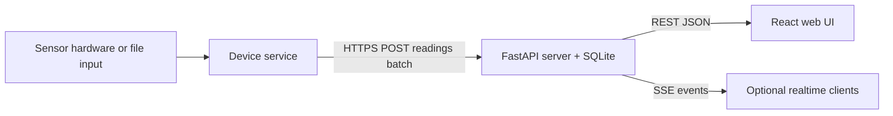

# Smart Home Inventory System - Solution Documentation

## Summary
The Smart Home Inventory System tracks physical inventory using sensors on a device,
stores readings in a central server, and exposes a web UI for status, alerts, and history.
It is built as three deployable services: a device agent, a FastAPI server, and a React UI.

## Architecture

## Repository layout
- `device/`: Python device service and sensor drivers.
- `server/`: FastAPI server with SQLite persistence and SSE events.
- `ui/`: React web UI for dashboard, alerts, and devices.
- `tests/ui/`: Playwright UI tests (fixture-based by default).

## Device service (`device/`)
### Responsibilities
- Read sensor values on a polling interval.
- Debounce/filter raw readings and convert them to a state.
- Persist readings locally in SQLite for offline tolerance.
- Upload batched readings to the server with retry backoff.

### Configuration
The device reads a JSON config file via `--config` or `SMART_INVENTORY_CONFIG`.
Keys are resolved with an `env:` prefix, for example `env:DEVICE_TOKEN`.

Top-level sections and common fields:
- `device`:
  - `id` (required)
  - `location` (optional)
  - `firmware` (default `0.1.0`)
- `network`:
  - `base_url` (required)
  - `api_token` (optional)
  - `ca_cert_path` (optional)
  - `batch_size` (default `25`)
  - `flush_interval_seconds` (default `15`)
  - `retry_max_seconds` (default `300`)
  - `connect_timeout_seconds` (default `5`)
  - `read_timeout_seconds` (default `10`)
- `storage`:
  - `queue_db_path` (required)
- `runtime`:
  - `poll_interval_ms` (default `200`)
  - `report_on_change_only` (default `true`)
- `sensors`: list of sensor entries with `id`, `type`, and type-specific params.

Sensor types:
- `digital_gpio`: Raspberry Pi GPIO input.
  - Params: `gpio_pin`, `active_high` (default true), `pull` (`up`, `down`, `none`)
- `hx711`: Load cell amplifier via the `hx711` library.
  - Params: `gpio_dout`, `gpio_sck`, `scale_factor`, `tare_offset`, `readings`, `gain`
- `file_sensor`: Dev-friendly sensor that reads values from a file path.
  - Params: `path`, `mode` (`analog` or `digital`), `scale_factor`, `tare_offset`

### Sensor processing
- Digital sensors are debounced before reporting.
- Analog sensors are filtered with a median filter.
- Threshold evaluation supports `low` and `ok` bands.
- `report_on_change_only` reduces noise by sending only state changes.

### Local queueing and delivery
Readings are stored in a local SQLite queue and uploaded in batches.
The service waits for either `batch_size` or `flush_interval_seconds`.
On failure, it backs off exponentially up to `retry_max_seconds`.
Server acknowledgements remove queued readings up to `ack_seq_id`.

## Server service (`server/`)
### Responsibilities
- Accept batched device readings.
- Persist inventory, sensor state, and alert history.
- Serve REST APIs for UI and operators.
- Broadcast events to SSE clients.

### Configuration
Environment variables with defaults:
- `INVENTORY_DB_PATH` (default `./data/inventory.db`)
- `INVENTORY_DEVICE_TOKENS` (comma-separated, optional)
- `INVENTORY_UI_TOKEN` (optional)
- `INVENTORY_ALLOW_UNAUTH` (default `false`)
- `INVENTORY_EVENT_QUEUE_SIZE` (default `100`)
- `INVENTORY_HISTORY_LIMIT` (default `2000`)
- `INVENTORY_CORS_ORIGINS` (comma-separated list, optional)

### Authentication model
- Devices authenticate with bearer tokens from `INVENTORY_DEVICE_TOKENS`.
- The UI authenticates with a single bearer token from `INVENTORY_UI_TOKEN`.
- If no tokens are configured, `INVENTORY_ALLOW_UNAUTH=true` is required.

### Database schema
Key tables (SQLite):
- `devices`: `id`, `firmware`, `last_seen`, `name`, `location`
- `sensors`: `id`, `device_id`, `type`, `thresholds`, `state_map`, `last_state`, `last_value`
- `items`: `id`, `sensor_id`, `name`, `thresholds`, `unit`, `image_url`
- `readings`: `sensor_id`, `seq_id`, `ts`, `raw_value`, `normalized_value`, `state`
- `alerts`: `item_id`, `sensor_id`, `type`, `status`, `message`, timestamps

### API endpoints
All endpoints require authentication unless `INVENTORY_ALLOW_UNAUTH=true`.

Device ingestion:
- `POST /api/v1/readings/batch`
  - Payload: device id, firmware, sent_at, array of readings.
  - Response: `ack_seq_id` and `server_time`.

Inventory and UI:
- `GET /api/v1/items`
- `GET /api/v1/items/{item_id}`
- `GET /api/v1/items/{item_id}/history?range=7d&limit=500`
- `POST /api/v1/items`
- `PUT /api/v1/items/{item_id}`
- `POST /api/v1/items/{item_id}/thresholds`
- `GET /api/v1/alerts?status=active`
- `POST /api/v1/alerts/{alert_id}/ack`
- `GET /api/v1/devices`
- `GET /api/v1/sensors`
- `GET /api/v1/stream` (SSE)
- `GET /api/v1/health`

### Alerts
- Alerts are created when a sensor state changes to `low` or `out`.
- Alerts resolve automatically when the state returns to `ok`.
- UI clients can acknowledge active alerts.

### Events (SSE)
The server publishes events such as:
- `item_status_update`
- `alert_created`
- `alert_resolved`
- `alert_acknowledged`

## UI (`ui/`)
### Responsibilities
- Display a dashboard of items and their current status.
- Show alert queue and device status.
- Cache data locally for quick reloads.

### Configuration
Environment variables:
- `VITE_API_BASE_URL` (default `http://localhost:8000`)
- `VITE_UI_TOKEN` (optional, matches `INVENTORY_UI_TOKEN`)
- `VITE_POLL_INTERVAL_MS` (default `15000`)

### Data flow and views
- Polls items, alerts, and devices on a fixed interval.
- Uses localStorage to cache lists and last refresh time.
- Dashboard view: item list, item detail, recent history.
- Alerts view: active alerts with acknowledge actions.
- Devices view: device id, firmware, last seen.

## End-to-end data flow
1. The device polls sensors and generates normalized readings.
2. The device queues readings locally and flushes to the server in batches.
3. The server stores readings, updates sensor state, and manages alerts.
4. The UI polls REST endpoints to render the latest inventory status.

## Running locally
### Device service
- `cp /workspace/device/config.example.json /tmp/smart-inventory-config.json`
- `python -m smart_inventory.main --config /tmp/smart-inventory-config.json`

### Server service
- `python -m venv .venv`
- `. .venv/bin/activate`
- `pip install -r server/requirements.txt`
- `uvicorn app.main:app --host 0.0.0.0 --port 8000`

### UI
- `cd ui`
- `npm install`
- `npm run dev`

## Testing
- Device unit tests:
  - `python3 -m unittest discover -s device/tests`
- UI tests (Playwright):
  - `npm install`
  - `npx playwright install`
  - `npm run test:ui`

If `BASE_URL` is not set, UI tests use the HTML fixture in `tests/ui/fixtures/`.

## Deployment notes
- Device service can run under systemd using `device/systemd/smart-inventory-device.service`.
- Store device config and queue DB on persistent storage.
- Run the server behind TLS or a reverse proxy and configure tokens.
- Configure CORS for the UI origin and set `VITE_API_BASE_URL`.

## Security considerations
- Always use HTTPS between device and server in production.
- Use strong bearer tokens for devices and UI clients.
- Keep `INVENTORY_ALLOW_UNAUTH=false` outside of development.
